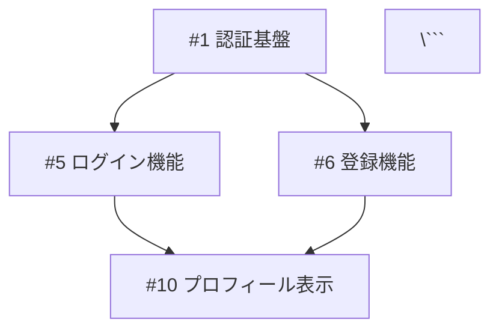

# 📊 プロジェクト管理ガイド

Issue駆動開発を効果的に進めるためのプロジェクト管理手法を紹介します。

---

## 📋 目次
1. [GitHub Projectsの活用](#github-projectsの活用)
2. [マイルストーンの使い方](#マイルストーンの使い方)
3. [Issue間の依存関係管理](#issue間の依存関係管理)
4. [チーム開発での運用](#チーム開発での運用)
5. [進捗管理とレポーティング](#進捗管理とレポーティング)

---

## 🗂️ GitHub Projectsの活用

### プロジェクトボードの作成

#### 1. 新規プロジェクト作成
1. リポジトリの **Projects** タブ
2. **New project** をクリック
3. テンプレートを選択（推奨: **Team backlog**）

#### 2. 推奨カラム構成

```
📋 Backlog (バックログ)
→ やるべきことリスト

🎯 Ready (準備完了)
→ 着手可能な状態

🚧 In Progress (作業中)
→ 現在取り組んでいる

👀 In Review (レビュー中)
→ PRがレビュー待ち

✅ Done (完了)
→ マージ済み・リリース済み
```

#### 3. 自動化設定

**推奨設定:**
- Issue作成時 → 自動で「Backlog」に追加
- PRオープン時 → 自動で「In Review」に移動
- PRマージ時 → 自動で「Done」に移動

**設定方法:**
1. プロジェクトの **⚙️ Settings**
2. **Workflows** で自動化ルールを追加

### 効果的な使い方

#### 個人開発の場合
```
Backlog: やりたいことを列挙
Ready: 今週やること3〜5個
In Progress: 同時進行は1〜2個まで
```

#### チーム開発の場合
```
Backlog: チーム全体のタスクプール
Ready: 優先度が高く、着手可能なもの
In Progress: 各メンバーが担当中（名前をアサイン）
```

---

## 🎯 マイルストーンの使い方

マイルストーンは「リリース」や「スプリント」など、期限のある目標を管理するのに最適です。

### マイルストーンの作成

1. **Issues** タブ > **Milestones**
2. **New milestone** をクリック
3. 必要項目を入力

**例:**
```
タイトル: v1.0 リリース
期限: 2026年3月31日
説明: 初回リリースに含める機能
```

### マイルストーンの活用例

#### パターン1: バージョンリリース
```
📌 v1.0 (2026/03/31)
  - #1: ログイン機能
  - #5: プロフィール表示
  - #12: 基本的なUI

📌 v1.1 (2026/04/30)
  - #15: プロフィール編集
  - #20: 通知機能
```

#### パターン2: スプリント管理
```
🏃 Sprint 1 (2/1-2/14)
  - #3: 認証API実装
  - #7: ユーザーモデル作成

🏃 Sprint 2 (2/15-2/28)
  - #10: フロントエンド実装
  - #14: テスト追加
```

#### パターン3: 機能単位
```
✨ ユーザー管理機能
  - #1: ユーザー登録
  - #2: ログイン
  - #3: プロフィール

✨ 投稿機能
  - #8: 投稿作成
  - #9: 投稿一覧
  - #10: 投稿編集
```

### マイルストーンの進捗確認

**Issues タブのマイルストーン画面で確認できること:**
- 完了率（プログレスバー）
- 残りのIssue数
- 期限までの残り日数

---

## 🔗 Issue間の依存関係管理

### 依存関係の記述方法

#### パターン1: Issue本文に記載
```markdown
## 依存関係
このIssueは以下に依存しています：
- Blocked by: #5（ログイン機能が先に必要）
- Related to: #12（同時に進めると効率的）

このIssueをブロックしているもの：
- Blocks: #20（この実装後に着手可能）
```

#### パターン2: タスクリスト形式
```markdown
## 前提条件
- [x] #5 ログイン機能の実装
- [ ] #8 APIエンドポイントの作成
- [ ] #10 データベーススキーマの更新

上記がすべて完了してから着手可能
```

#### パターン3: ラベルで管理
- `Status: Blocked` ラベルを付与
- コメントで何にブロックされているか明記

### 依存関係の可視化

#### GitHub Projects での管理
- カスタムフィールドを追加
- 「Blocked by」フィールドに依存Issueを記載

#### 外部ツールの活用
- **Mermaid図** をIssueに埋め込む

```markdown


---

## 👥 チーム開発での運用

### ロールと責任

#### 推奨ロール

**プロダクトオーナー（PO）**
- 要件定義とIssueの作成
- 優先度の決定
- 受け入れ基準（DoD）の確認

**開発者（Developer）**
- Issueの実装
- PRの作成とレビュー
- テストの作成

**レビュアー（Reviewer）**
- コードレビュー
- 品質チェック
- ナレッジシェア

### ワークフローの例

#### 週次サイクル
```
月曜:
- 週次ミーティング
- Backlogから今週やることをReadyへ移動
- Issue優先度の見直し

火〜木:
- 各自担当Issueを実装
- 完了したらPR作成
- 相互レビュー

金曜:
- 週次レビュー会
- 完了事項の確認
- 来週の計画

```

#### スプリント運営（2週間）
```
Day 1: スプリント計画
- マイルストーン作成
- Issueの見積もり
- 担当者アサイン

Day 2-9: 開発・レビュー
- デイリースタンドアップ（任意）
- 継続的な開発とレビュー

Day 10: スプリントレビュー
- 完成物のデモ
- フィードバック収集

Day 10: レトロスペクティブ
- 振り返り
- 改善案の議論
```

### コミュニケーション

#### Issueでのコミュニケーション
```markdown
✅ すべき:
- 進捗報告（定期的に）
- ブロッカーの報告（すぐに）
- 質問や相談（早めに）

❌ 避ける:
- 長時間の沈黙
- 独断での仕様変更
- 問題の隠蔽
```

#### PR作成時のメンション
```markdown
## レビュー依頼
@alice フロントエンドのレビューをお願いします
@bob APIの実装について確認してください

## FYI（参考）
@charlie こちらも関連する内容です
```

---

## 📈 進捗管理とレポーティング

### 進捗の可視化

#### 1. GitHub Insights の活用
- **Pulse**: 直近の活動サマリー
- **Contributors**: メンバーごとの貢献
- **Traffic**: アクセス状況

#### 2. マイルストーンの進捗率
```
v1.0 リリース: ████████░░ 80% (8/10 完了)
残り2 Issue, 期限まで5日
```

#### 3. ラベルによる集計
```
Type: Feature   → 15 Issues (10 完了)
Type: Bug       → 5 Issues (4 完了)
Priority: High  → 8 Issues (6 完了)
```

### 定期レポート

#### 週次レポート例
```markdown
## 📊 今週の進捗 (2/1 - 2/7)

### 完了 ✅
- #12: ログイン機能実装 (@alice)
- #15: プロフィールUI改善 (@bob)
- #18: バグ修正 (@charlie)

### 進行中 🚧
- #20: 通知機能 (@alice) - 70%完了
- #22: パフォーマンス改善 (@bob) - 30%完了

### ブロッカー ⚠️
- #25: API連携 - 外部サービスの仕様待ち

### 来週の予定 📅
- #20 の完了とリリース
- #22 の継続
- #30 新機能の着手
```

#### スプリントレビュー例
```markdown
## 🏃 Sprint 3 レビュー

### 目標達成度
- 計画: 10 Issues
- 完了: 8 Issues (80%)
- 未完: 2 Issues → 次スプリントへ繰越

### ベロシティ
- 前回: 25 ポイント
- 今回: 28 ポイント
- 傾向: 改善 ↗️

### 良かった点 👏
- チーム間のコミュニケーションが活発
- 早期のレビューでバグ削減

### 改善点 🔧
- 見積もりの精度向上が必要
- テストの自動化を進める
```

---

## 🔧 ツール連携

### Slack連携
GitHub Appを使ってIssue/PR通知をSlackへ

```
/github subscribe owner/repo issues pulls
/github subscribe owner/repo reviews comments
```

### Discord連携
WebhookでDiscordチャンネルに通知

### Notion連携
- GitHub IssuesをNotionデータベースと同期
- ロードマップやドキュメント管理

---

## 📚 参考テンプレート

### Issue整理会議のアジェンダ
```markdown
## 📋 Issue整理会議 (Backlog Grooming)

### 1. 新規Issue確認 (10分)
- 先週作成されたIssueのレビュー
- 不明点の確認

### 2. 優先度の見直し (15分)
- Priorityラベルの調整
- 緊急対応が必要なものの確認

### 3. 詳細化が必要なIssue (15分)
- 要件が不明確なIssueの議論
- 完了条件（DoD）の明確化

### 4. 依存関係の整理 (10分)
- ブロッカーの確認
- 着手順序の調整

### 5. アサイン (10分)
- 担当者の決定
- 見積もり（任意）
```

---

## ✅ プロジェクト管理チェックリスト

### 初期セットアップ
- [ ] GitHub Projectsボード作成
- [ ] ラベル体系の整備
- [ ] Issue/PRテンプレート整備
- [ ] チーム内のルール共有

### 日次・週次
- [ ] 新しいIssueの確認
- [ ] 進行中PRのレビュー
- [ ] ブロッカーの解消
- [ ] 週次レポート作成

### マイルストーン
- [ ] マイルストーンの設定
- [ ] Issue割り当て
- [ ] 進捗の可視化
- [ ] 完了時のレビュー

---

**Remember:** プロジェクト管理の目的は「管理すること」ではなく、「チームが効率的に価値を届けること」です 🚀
